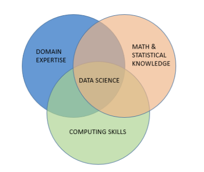
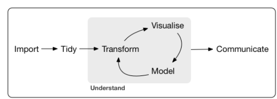
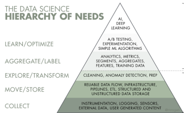

**Update** This will be converted into a longer form book [DS Principles & Resources - Igor V](https://github.com/iveksl2/ds_book) using [Quarto Books](https://quarto.org/docs/books/) & [NBDev](https://nbdev.fast.ai/).   Go there for a deeper undersanding. This is a collection of my own scripts for my own benefit

DS Definition              |  Pipeline                |  AI Hierarchy of Needs       |
:-------------------------:|:-------------------------:|:-------------------------:
  |    |  |

We live in the precipice of a golden age of education:

One can create open wiki books with [bookdown](https://github.com/rstudio/bookdown)([gallery](https://bookdown.org/)) or [jupyter_book](https://jupyterbook.org/intro.html) ([gallery](https://executablebooks.org/en/latest/gallery.html)). *Remember to make a contribution to authors*

---
**DataScience**
---

[Best Practices](./best_practices)

Fundamentals:
* [Mathematics & Statistics](math_and_stats)
* [Software Engineering](./Software_Engineering)
* [Domain Knowledge](./domain_knowledge)
* Pipeline
    * [Import](./import_and_prep)
    * [Tidy](./tidy_and_prep)
    * Transform
    * [Visualize](./visualize)
    * Model
    * [Communicate](./communicate)
 
Sub-Topics:
* Bayesian Statistics
* [Optimization](./optimization)
* [Time Series](./time_series)
* [NLP](./nlp)
* Reinforcement Learning  
* Deep Learning 
* [Image](./image)
* Generative Models
* [Simulation](./simulation)
* [Survival Models](./survival_models)
* [Misc](./misc)

---
Other Repositories that do this better:
  * [data-science-topics](https://khuyentran1401.github.io/Data-science/) & [github](https://github.com/khuyentran1401/Data-science#data-science-portfolio) - Khuyen Tran
  * [applied-ml github](https://github.com/eugeneyan/applied-ml) & [applied-ml website papers](https://applyingml.com/papers/) - Eugene Yan
  * [CS 329S: Machine Learning Systems Design](https://stanford-cs329s.github.io/syllabus.html) - Very hit or miss with random guest lecturers <Storing> 
